# Chatterbox Plugin for Obsidian

Chatterbox is an Obsidian plugin for rendering dialogues and conversations.
It is designed to be easily customizable through CSS snippets and reusable configuration options.

<p align="center">
  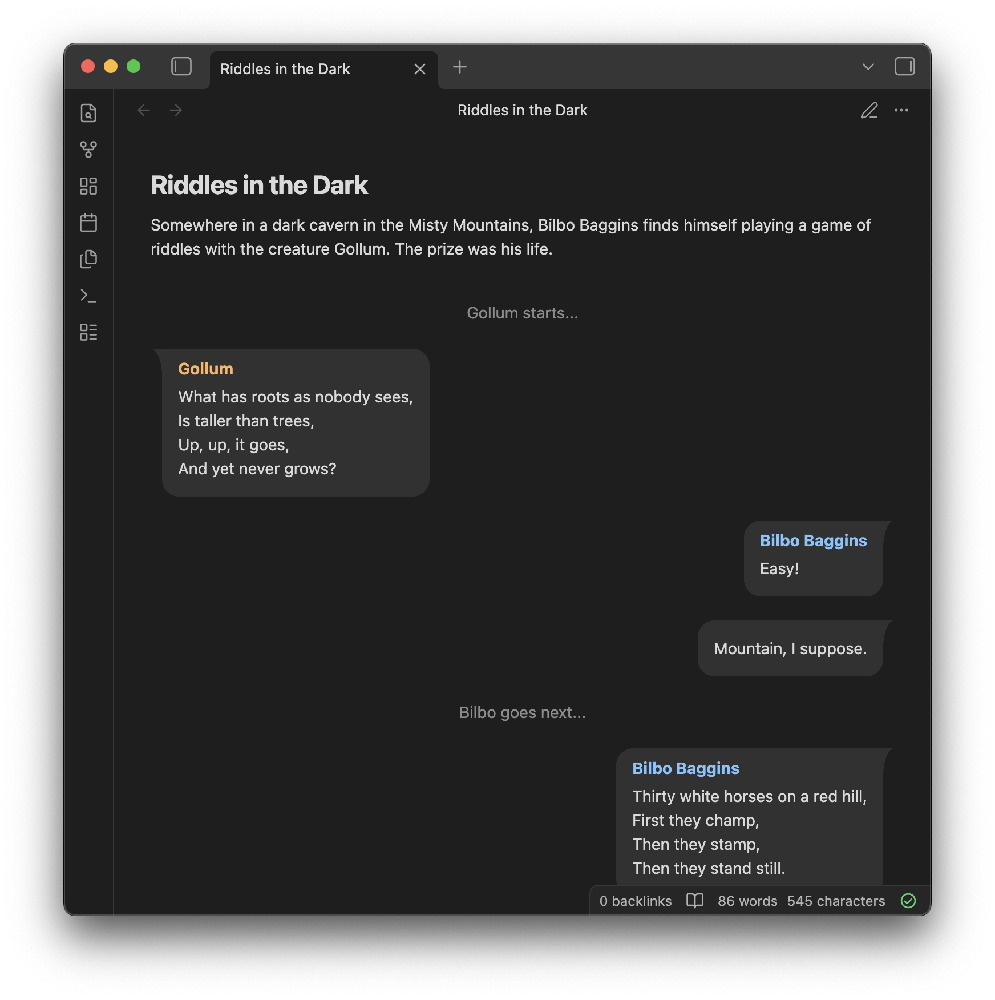
</p>

<!-- ------------------------------------------------------------------------------------------- -->

## Usage

Chatterbox conversations are written in code blocks with `chatterbox` as the block's language.
Below is an example conversation containing the major Chatterbox entry types.
The rest of this section describes each entry type in detail.

###### Input

````
```chatterbox
# This is an example conversation between Alice, Bob, and Carol. They are trying to decide on their weekend plans.

Alice | 12:00 pm > Hi everyone. What do you want to do this weekend?

Bob | 12:01 pm < How about we go watch a movie?

Carol | 12:02 pm < I'm in as long as I pick the movie!!!

Alice | 12:03 pm >@ <p style="font-size: 3em; text-align: center;">🙄</p>

Alice | 12:03 pm >! Fine! What are we watching?

...

#() A few days later

Bob | 7:33 pm < I'm leaving the house now. Anyone need a ride?
```
````

###### Output

<p align="center">
  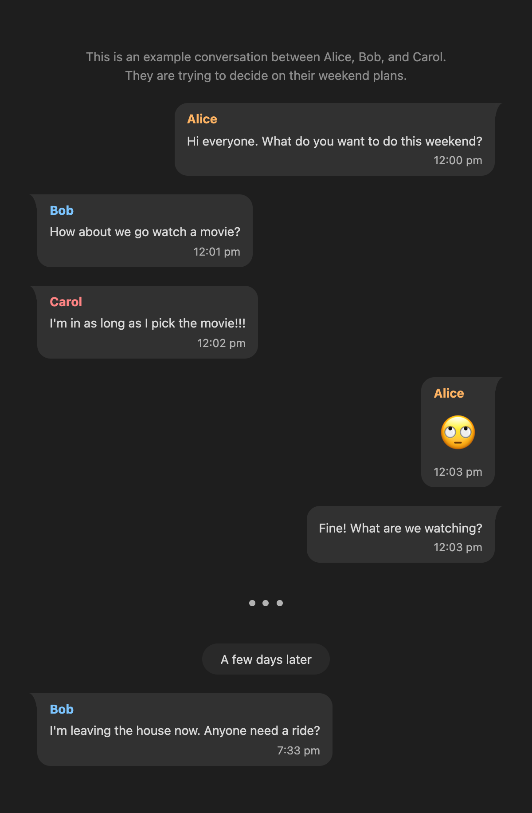
</p>

### Basic Entry Types

Below are the entry types supported by Chatterbox.
Any line that doesn't match one of these entry types is ignored.
All entry types that support custom text content allow you to use
[character references](https://developer.mozilla.org/en-US/docs/Glossary/Character_reference)
for encoding special characters in the supplied text.

#### Messages

Messages are the primary entry type and each has an **author**, a **direction** (_left_, _right_,
or _center_), and some text **content**.
The message direction is specified using either `>` for right, `<` for left, or `^` for center.

For example:

###### Input

````
```chatterbox
Alice > This is a message from Alice in the right direction.

Bob < This is a message from Bob in the left direction.

Carol ^ This is a message from Carol in the center.
```
````

###### Output

<p align="center">
  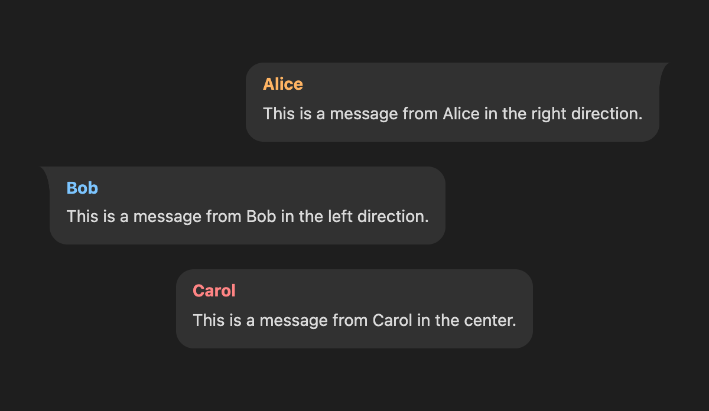
</p>

Optionally, messages can include some **subtext**.
You would usually place the send time of the message here.
You can add subtext to a message by adding a vertical bar `|` followed by the subtext content
between the author and the message direction marker.

For example:

###### Input

````
```chatterbox
Alice | 12:00 pm > Hi Bob! What are you doing today?

Bob | 12:01 pm < Hi Alice! Just visiting th family.
```
````

###### Output

<p align="center">
  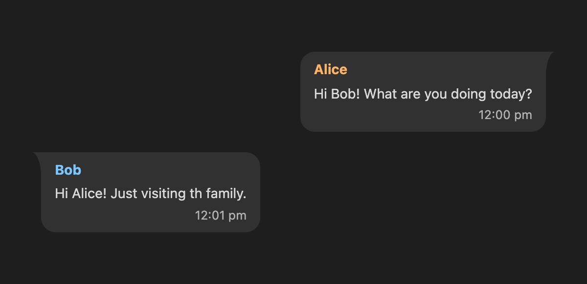
</p>

> [!NOTE]
> To use a vertical bar as part of the author's name, you can escape it as `&vert;`.
> Similarly, you can escape the message direction markers using `&gt;` for `>`, `&lt;` for `<`,
> and `&Hat;` for `^`.
> Alternatively, you can use these characters as part of the [`authorFull`]() config property.

By default, each message will display the author's name.
Sometimes, we want to hide the author's name (e.g. when displaying consecutive messages from the
same author).
We can do this either using the `!` modifier or by omitting the name author's name altogether.

For example:

###### Input

````
```chatterbox
Alice > This is the first message from Alice with her name showing.

Alice >! This is the second message from Alice without her name showing.

> This is a message from an anonymous author.

Bob < This is the first message from Bob without his name showing.
```
````

###### Output

<p align="center">
  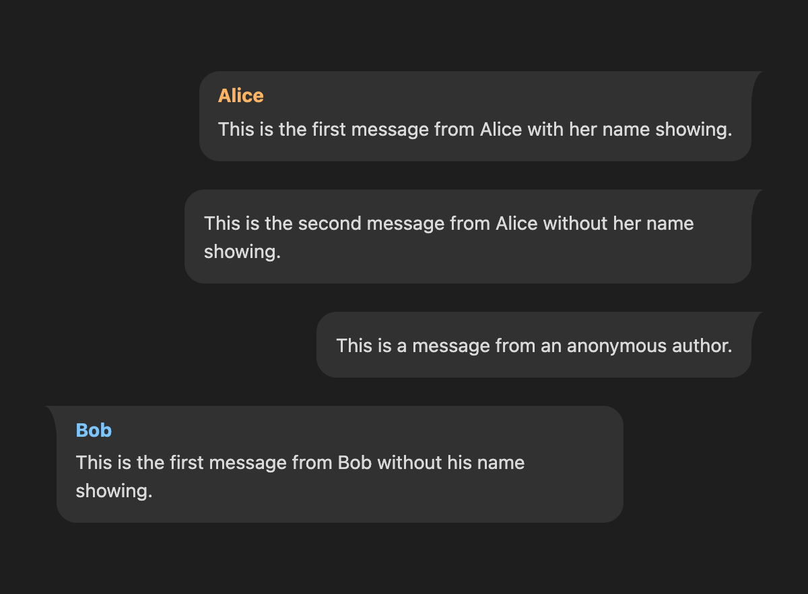
</p>

> [!IMPORTANT]
>
> Avoid omitting the author's name if you would like to apply their
[author-specific configuration](#authors) to the message entry.
> Use the `!` modifier instead.
>
> Messages that have no author specified are considered to come from an _anonymous author_ which is
> a completely separate author altogether and can have their own author-specific configuration.

Finally, we can also render the content of a message entry as Markdown by using the `@` modifier.

For example:

###### Input

````
```chatterbox
Alice > This is some **Markdown content** <br> rendered as `plain text`.

Alice >@ This is some **Markdown content** <br> rendered as `Markdown`.
```
````

###### Output

<p align="center">
  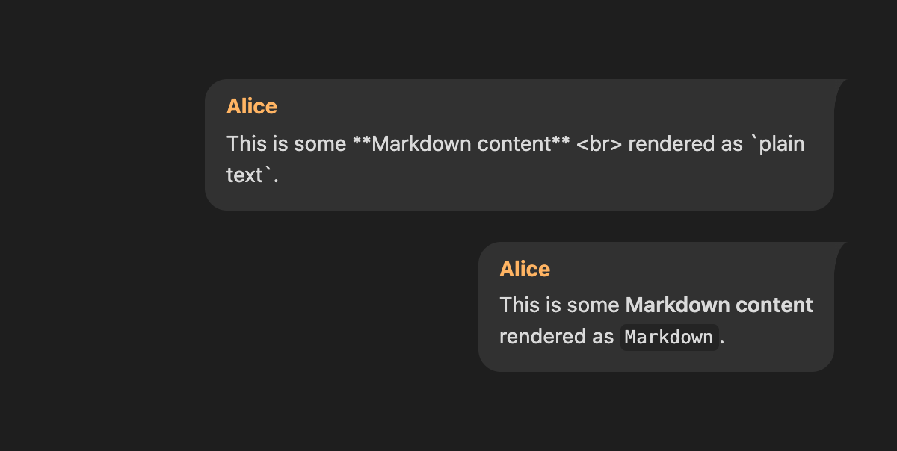
</p>

> [!WARNING]
>
> Both the `!` and the `@` modifiers should come after the direction marker (`>`, `<`, or `^`)
> **WITHOUT** any spaces in between.

#### Comments

Comments allow you to interleave text commentary between messages.
They can be created by writing `#` at the beginning of a line followed by the comment content.

For example:

###### Input

````
```chatterbox
Alice > This is a message from Alice.

# This is a comment entry.

Bob < This is a message from Bob after a comment.

```
````

###### Output

<p align="center">
  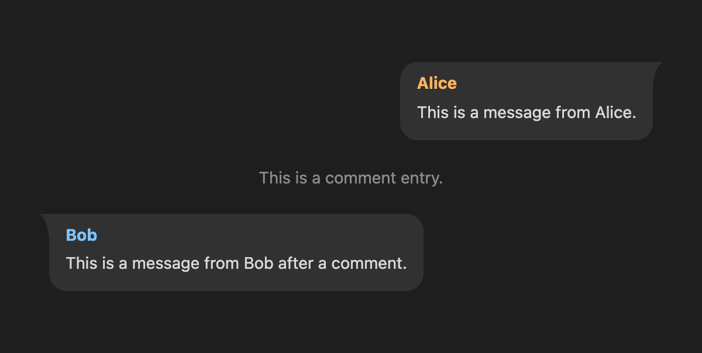
</p>

#### Capsules

Capsules are special types of comments that are enclosed in a capsule.
They're usually used to demarcate a group of messages that occur in the same time frame.
They can be created by adding a `()` modifier to the comment marker `#` at the beginning of a line followed by the capsule content.

For example:

###### Input

````
```chatterbox
#() Yesterday

Alice > Do you want to meet today?

Bob < How about tomorrow morning? Coffee?

Alice > Sure thing!

#() Today

Bob < I'm heading to Starbucks.

Alice > I'll see you there.
```
````

###### Output

<p align="center">
  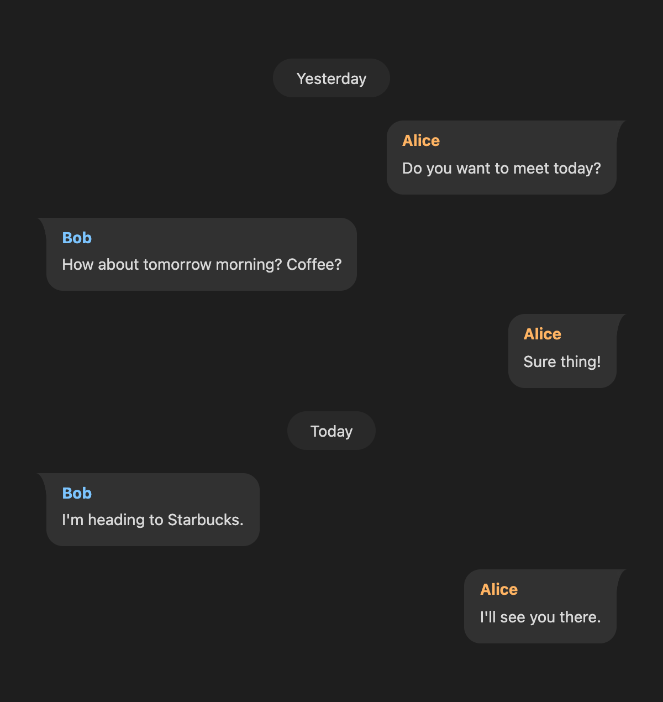
</p>

#### Delimiters

Delimiters can be used to show a break or a skip in a conversation.
You can add a delimiter by writing `...` on it's own line.

For example:

###### Input

````
```chatterbox
Alice > This is a message from Alice.

...

... This is not a valid delimiter line and will be ignored.

Bob < This is a message from Bob after a delimiter.

```
````

###### Output

<p align="center">
  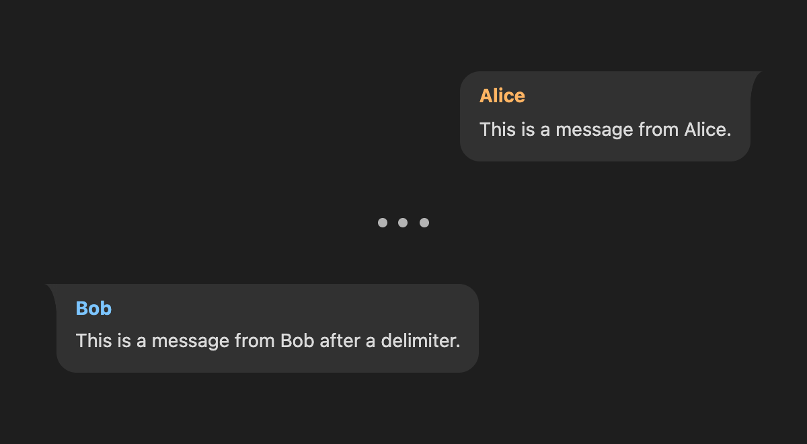
</p>

### Multi-line Entries

Message, comment, and capsule entries can also be written as multi-line blocks by repeating their
respective entry markers three or more times to start the block, and using the **same** number of
markers excluding any modifiers on a **separate** line with no other content to close it.

For example:

###### Input

````
```chatterbox
Alice >>> This is a
multiline message
from
Alice.
>>>

Bob <<<<<@ This is a multiline
**Markdown message**

from <span style="font-size: 2em;">Bob</span>.
<<<<<

### This is a
multiline
comment.
###

####() This is a
multiline
capsule.
####
```
````

###### Output

<p align="center">
  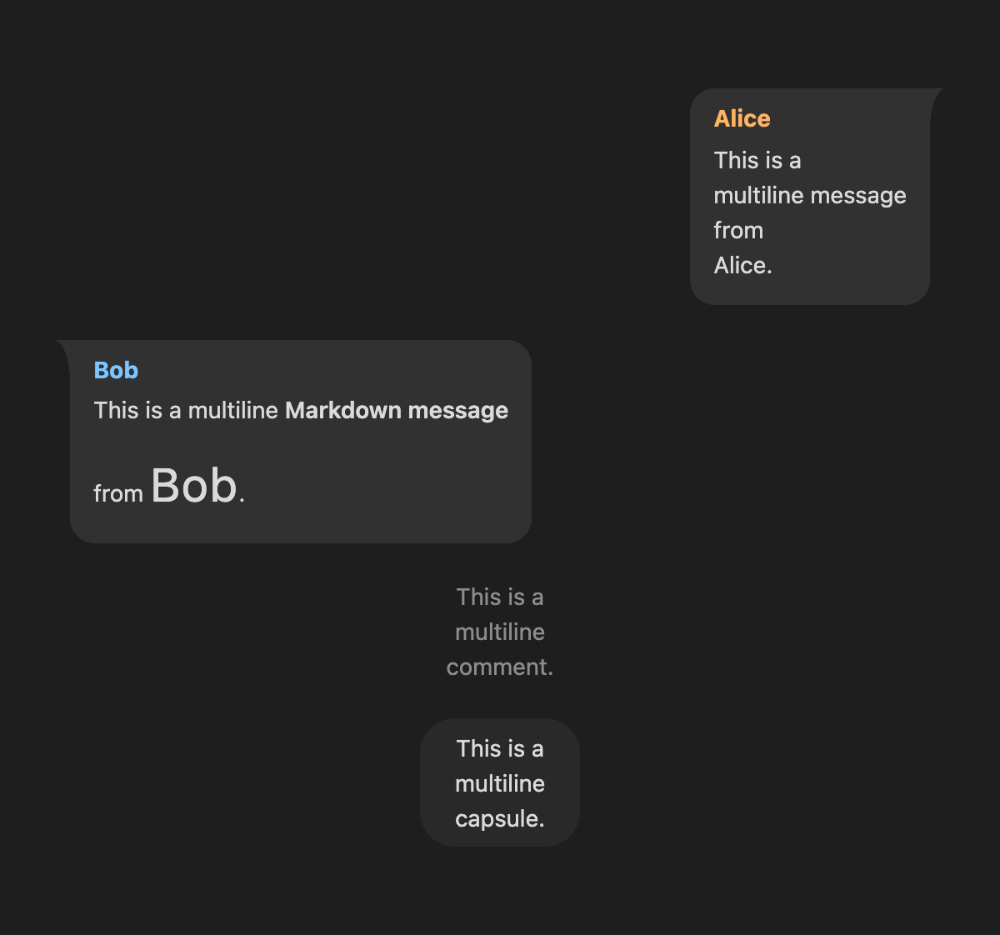
</p>

#### Markdown Blocks

In addition to the other multi-line entries, Chatterbox provides a Markdown block entry type which
enables you to embed
[Obsidian Flavored Markdown](https://help.obsidian.md/obsidian-flavored-markdown) content within a
conversation.
This means anything you can do inside an Obsidian note should work inside a Chatterbox Markdown
block as well.

This can be useful to replicate certain scenarios such as conversations with an LLM.
You can insert Markdown blocks between two lines containing 3 or more `@` characters.
Like the other multi-line entries, the closing line should contain the same number of `@` characters
as the start of the block on a separate line with no other content.

For example:

###### Input

````
```chatterbox
> Can you list Maxwell's equations in differential form?

@@@
Sure — Maxwell’s equations in **differential form** (SI units), using fields $E$ (electric field), $B$ (magnetic flux density), $\rho$ (charge density), and $J$ (current density):

1. **Gauss’s law (electric):**
    $$
    \nabla \cdot \mathbf{E}=\frac{\rho}{\varepsilon_0}
    $$

2. **Gauss’s law (magnetism):**
    $$
    \nabla \cdot \mathbf{B}=0
    $$

3. **Faraday’s law of induction:**
    $$
    \nabla \times \mathbf{E}=-\frac{\partial \mathbf{B}}{\partial t}
    $$

4. **Ampère–Maxwell law:**
    $$
    \nabla \times \mathbf{B}=\mu_0 \mathbf{J}+\mu_0 \varepsilon_0 \frac{\partial \mathbf{E}}{\partial t}
    $$
@@@

> Thanks!
```
````

###### Output

<p align="center">
  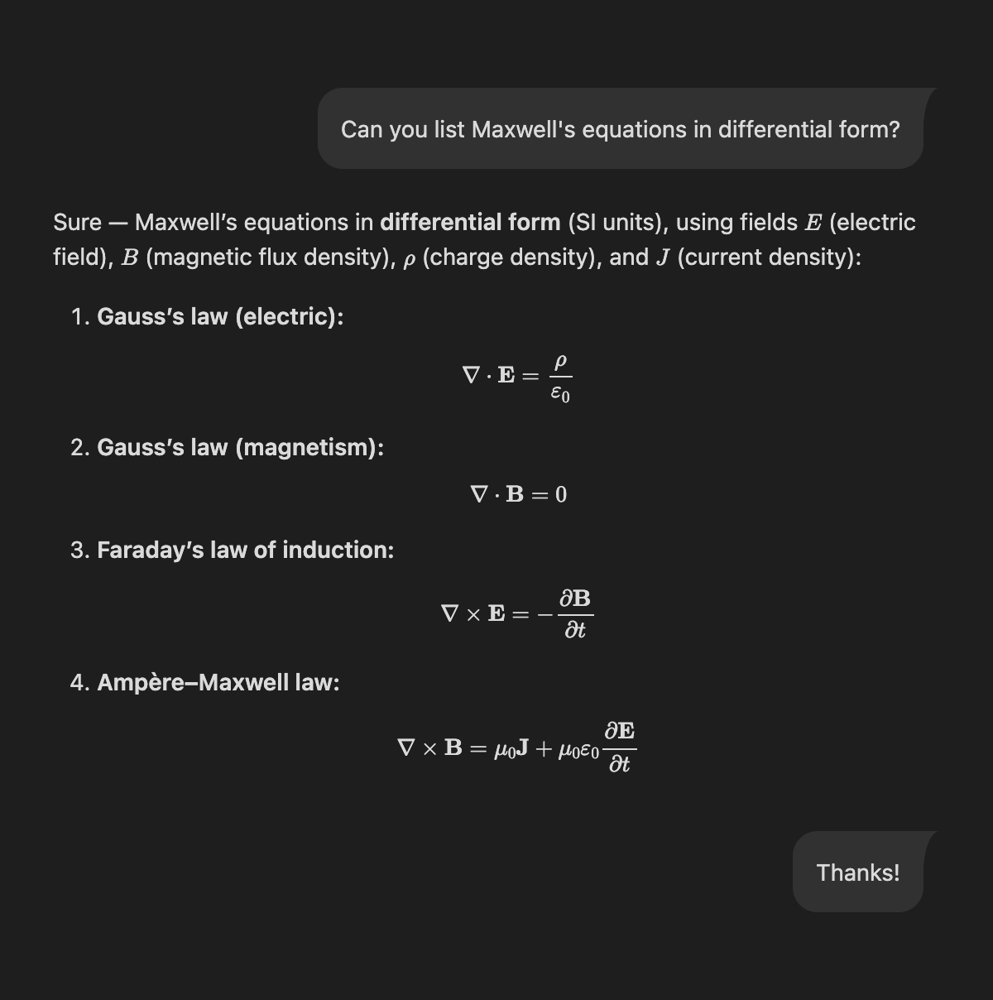
</p>

> [!NOTE]
>
> The above example was an actual conversation with ChatGPT with it's exact output copied and
> pasted.
> It has been slightly edited; most notably, the LaTeX math blocks were changed to use `$$`
> instead of `[` and `]` so that they render properly in Obsidian.


<!-- ------------------------------------------------------------------------------------------- -->

## Configuration

Each Chatterbox code block can be configured using a [YAML](https://yaml.org/) frontmatter block at
the very beginning.
Among other things, you can configure which rendering mode to use and customize the appearance of
message entries for specific authors.

For example:

###### Input

````
```chatterbox
---
mode: simple
authors:
  a:
    authorFull: "Alice Archer"
    authorColor: "#c00e60"
    bgColor: "#c00e6020"
    subtextColor: yellow
  b:
    authorFull: "Bob Baker"
    authorColor: teal
---

a | 12:00 pm > Hi, Bob!

b | 12:01 pm < Hi, Alice! Nice colors you have there!

a | 12:02 pm > Thanks!
```
````

###### Output

<p align="center">
  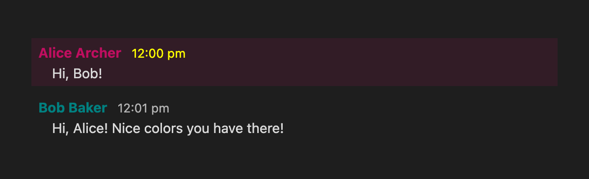
</p>

Below is a list of all available configuration options.

### **`authors`**

You can set author-specific configuration options that can influence how their associated message
entries are rendered.
The `authors` object uses an author's name as a key (**AFTER** unescaping/decoding any
[character references](https://developer.mozilla.org/en-US/docs/Glossary/Character_reference)) and
an author-specific configuration object as a value.

You can customize the anonymous author using `""` as the author key.
This includes giving the anonymous author a name using the `authorFull` property.

Below are the possible options that can be set

##### **`authorFull`**

Replaces the author's name with a full or alternate name in their associated message entries.
This makes writing long author names more convenient by using a smaller alias throughout a
conversation.

For example, instead of writing:

````
```chatterbox
Frodo Baggins > You're late.

Gandalf the Grey < A Wizard is never late, Frodo Baggins, nor is he early.

Gandalf the Grey <! He arrives precisely when he means to.
```
````

We can write:

````
```chatterbox
---
authors:
  f:
    authorFull: "Frodo Baggins"
  g:
    authorFull: "Gandalf the Grey"
---

f > You're late.

g < A Wizard is never late, Frodo Baggins, nor is he early.

g <! He arrives precisely when he means to.
```
````

##### **`authorColor`**

Sets the color of the author's name in their associated message entries.
Can be set to any CSS color value (e.g. `"#ff0000"`, `"red"`, `"var(--my-custom-color)"`, etc.).

##### **`bgColor`**

Sets the background color of the author's associated message entries.
Can be set to any CSS color value (e.g. `"#ff0000"`, `"red"`, `"var(--my-custom-color)"`, etc.).

##### **`textColor`**

Sets the color of the author's text content in their associated message entries.
Can be set to any CSS color value (e.g. `"#ff0000"`, `"red"`, `"var(--my-custom-color)"`, etc.).

### **`autoColorAuthors`**

If set to `true` then the author names are assigned a color automatically based on their order of
appearance in the conversation with the exception of the anonymous author.
Otherwise, if set to `false` then all author names are rendered using the default text color.
It is set to `true` by default.

There are a total of 8 colors which cycle over when the number of unique authors exceed that number.
You can also use these pre-defined colors as values for `authorColor`, `bgColor`, and `textColor`
using their respective CSS variables: `var(--auto-color-1)` to `var(--auto-color-8)`.

### **`chatterboxId`**

Sets the `data-chatterbox-id`
[data attribute](https://developer.mozilla.org/en-US/docs/Web/HTML/Reference/Global_attributes/data-*)
of the current Chatterbox block to a given string.
This can be used to create custom themes and styling for conversations that share the same
`chatterboxId` value.

### **`maxCapsuleWidth`**

Sets the maximum width of capsule entries.
Can be set to any CSS length value (eg. `"20%"`, `"200px"`, `"20em"`, `"var(--my-custom-size)"`,
etc.)

### **`maxCommentWidth`**

Sets the maximum width of comment entries.
Can be set to any CSS length value (eg. `"20%"`, `"200px"`, `"20em"`, `"var(--my-custom-size)"`,
etc.)

### **`minMessageWidth`**

Sets the minimum width of message entries.
Can be set to any CSS length value (eg. `"20%"`, `"200px"`, `"20em"`, `"var(--my-custom-size)"`,
etc.)

### **`maxMessageWidth`**

Sets the maximum width of message entries.
Can be set to any CSS length value (eg. `"20%"`, `"200px"`, `"20em"`, `"var(--my-custom-size)"`,
etc.)

### **`mode`**

Sets the rendering mode for the current Chatterbox block.
The currently supported modes are:

- `"bubble"`: tries to emulate the style of apps like WhatsApp or Google Chat.
- `"simple"`: tries to emulate the style of apps like Discord or Slack. Ignores message direction
  and the `minMessageWidth` and `maxMessageWidth` configuration options.

By default, Chatterbox uses `"bubble"` mode.

Consider the following example Chatterbox code block:

````
```chatterbox
---
mode: bubble
---

# This is an example conversation between Alice, Bob, and Carol. They are trying to decide on their weekend plans.

Alice | 12:00 pm > Hi everyone. What do you want to do this weekend?

Bob | 12:01 pm < How about we go watch a movie?

Carol | 12:02 pm < I'm in as long as I pick the movie!!!

Alice | 12:03 pm >@ <p style="font-size: 3em; text-align: center;">🙄</p>

Alice | 12:03 pm >! Fine! What are we watching?

...

#() A few days later

Bob | 7:33 pm < I'm leaving the house now. Anyone need a ride?
```
````

The examples below display the same content rendered in the different available modes.

##### `"bubble"`

<p align="center">
  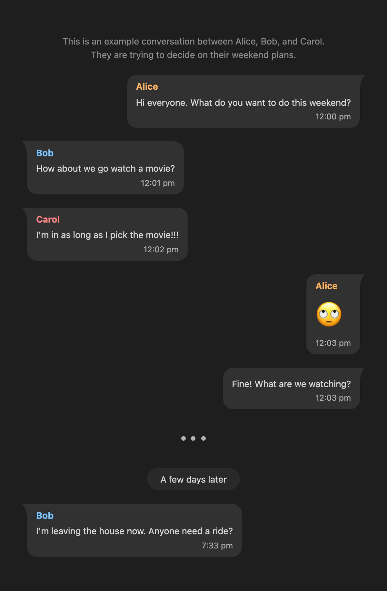
</p>

##### `"simple"`

<p align="center">
  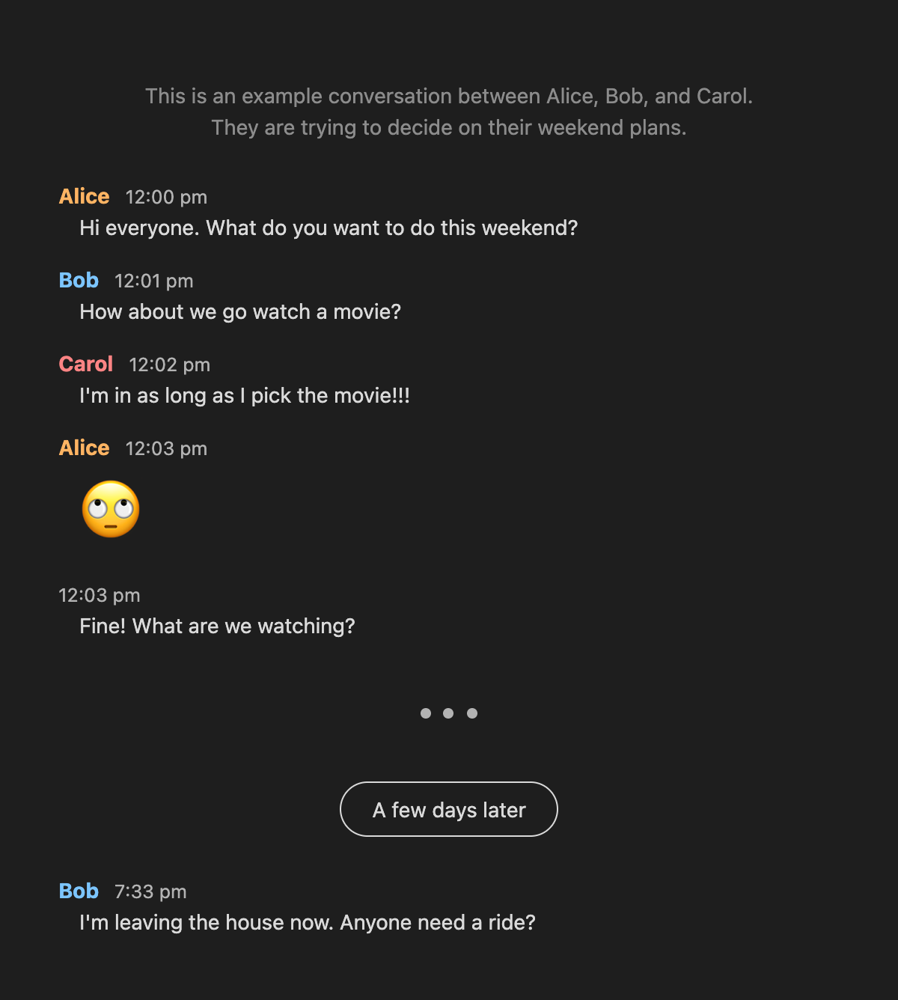
</p>

<!-- ------------------------------------------------------------------------------------------- -->

## Plugin Settings

> [!NOTE]
> You may need to restart the Chatterbox plugin or close and reopen notes containing a Chatterbox
> block for changes to take effect.

#### Default configuration

If you have some configuration options that you use frequently, you can place them in the text area
provided for this option.
These will be applied automatically to all Chatterbox blocks and can be overwritten in the
configuration of each individual block.

<!-- ------------------------------------------------------------------------------------------- -->

## Styling

Chatterbox was designed to be easily customizable through CSS snippets.
See [STYLING.md](STYLING.md) for more details.

<!-- ------------------------------------------------------------------------------------------- -->

## License

This project is available under the MIT license. See the [LICENSE file](LICENSE) for more
information.
